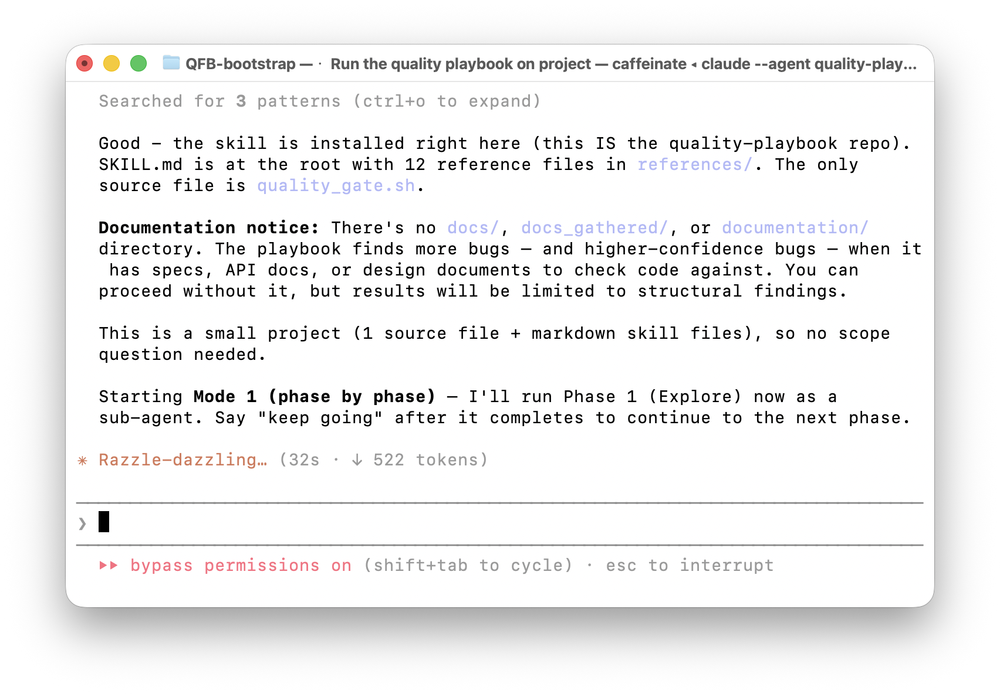
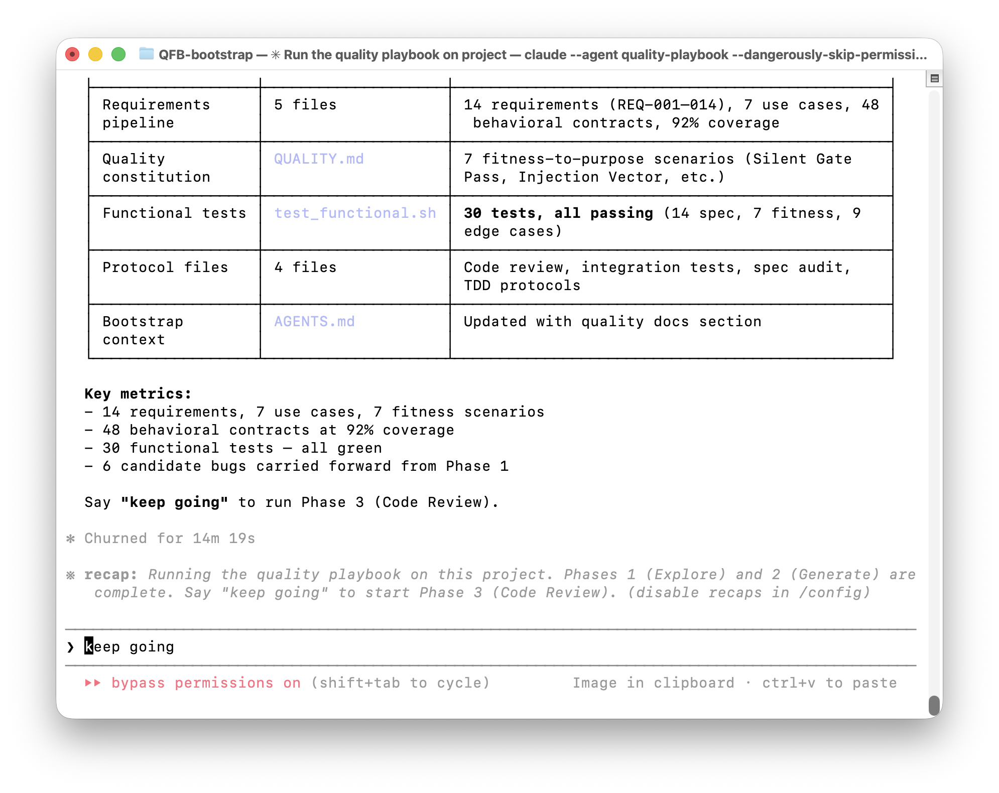

# Quality Playbook

Point an AI coding tool at any codebase. Get a complete quality engineering infrastructure: requirements derived from the actual intent of the code, functional tests traced to those requirements, a three-pass code review protocol, and a multi-model spec audit that catches bugs no single reviewer can find alone.

**Version:** 1.4.0 | **Author:** [Andrew Stellman](https://github.com/andrewstellman) | **License:** Apache 2.0

## The problem

Most AI code review can only find structural issues: null dereferences, resource leaks, race conditions. That catches about 65% of real defects. The other 35% are intent violations -- bugs that can only be found if you know what the code is *supposed* to do. A function that silently returns null instead of throwing, a duplicate-key check that passes when the first value is null, a sanitization step that runs after the branch decision it was supposed to guard. These bugs look correct to any reviewer that doesn't know the spec.

The playbook closes that gap. It reads your codebase, derives behavioral requirements from every source it can find (code, docs, specs, comments, defensive patterns, community documentation), and uses those requirements to drive review. The result is a quality system grounded in intent, not just structure. For a deeper look at this problem, see the O'Reilly Radar article [AI Is Writing Our Code Faster Than We Can Verify It](https://www.oreilly.com/radar/ai-is-writing-our-code-faster-than-we-can-verify-it/).

## How to use the Quality Playbook to find bugs in your code

### Step 1: Gather documentation (do this first!)

The playbook finds bugs by checking code against intent — what the code is *supposed* to do. Without documentation, it can only find structural issues. With documentation, it finds the 35% of real defects that structural review alone misses. This is the single most impactful thing you can do to improve results.

Create a `docs_gathered/` directory in your project and fill it with everything you can find about what the code should do. The more context you give the playbook, the more bugs it finds. Here are sources to look for:

**Official documentation:** API docs, design documents, architecture decision records (ADRs), RFCs, specs, OpenAPI/Swagger definitions, man pages, protocol specifications, configuration references, deployment guides, runbooks.

**Internal knowledge:** Slack channels (export relevant threads), Microsoft Teams call transcripts, meeting notes, onboarding docs, internal wikis, Confluence pages, Notion databases, Google Docs, engineering blog posts, post-mortems, incident reports.

**Community sources:** GitHub issues and discussions (especially bug reports — they describe expected vs. actual behavior), Stack Overflow threads, Reddit posts (especially from subreddits like r/golang, r/rust, r/python where maintainers are active), forum discussions, Discord server archives, mailing list archives, blog posts by maintainers or power users.

**AI conversation history:** If you've discussed the codebase with AI tools, those conversations contain intent that may not exist anywhere else. Export chat history using browser extensions like [ChatGPT Exporter](https://github.com/pionxzh/chatgpt-exporter) or similar tools for Claude, Gemini, and other platforms. Even copy-pasting key conversations into markdown files works.

**Code-adjacent artifacts:** Test descriptions and comments (they describe intended behavior), commit messages (especially for bug fixes — they describe what *should* have been happening), PR descriptions, CHANGELOG entries, release notes, migration guides.

**Tip: Use AI to help gather documentation.** Tools like Claude Cowork, OpenAI Codex, or even a plain ChatGPT/Claude session with web search can find and compile documentation for you. Try prompts like: *"Search for community documentation, API references, known issues, and design discussions for [project name]. Compile everything you find into a single reference document."* The AI can search GitHub issues, read project wikis, find relevant Stack Overflow answers, and pull it all together into a docs_gathered/ folder. This step alone can take a mediocre playbook run and turn it into a great one.

### Step 2: Install the skill

The playbook is a skill file that your AI coding tool reads and follows. Copy it into your project in the location your tool expects.

**Claude Code:**
```bash
mkdir -p .claude/skills/quality-playbook/references
cp SKILL.md .claude/skills/quality-playbook/SKILL.md
cp LICENSE.txt .claude/skills/quality-playbook/LICENSE.txt
cp references/* .claude/skills/quality-playbook/references/
```

**GitHub Copilot:**
```bash
mkdir -p .github/skills/references
cp SKILL.md .github/skills/SKILL.md
cp LICENSE.txt .github/skills/LICENSE.txt
cp references/* .github/skills/references/
```

**Cursor, Windsurf, and other tools:** Use either install location above — the skill checks both. Or just put `SKILL.md` and the `references/` directory in your project root.

### Step 3: Run the playbook

The playbook runs in six phases, each in its own context window. This isn't a limitation — it's a design choice. Each phase gets the full context window for deep analysis instead of competing for space with other phases. More context per phase means more bugs found.

<a href="images/claude-code-bootstrap-1.png"></a>

*Phase 1: The playbook explores the codebase, reads documentation, and identifies candidate bugs for deeper investigation.*

**Claude Code — interactive (recommended for first run):**
```bash
claude --agent agents/quality-playbook.agent.md
```
The agent runs Phase 1, shows you what it found, and asks you to say "keep going" to continue to the next phase. This lets you see results as they come in and take screenshots.

To skip permission prompts, add `--dangerously-skip-permissions`:
```bash
claude --agent agents/quality-playbook.agent.md --dangerously-skip-permissions
```

**GitHub Copilot (CLI) — interactive:**
```bash
copilot-cli --agent agents/quality-playbook.agent.md
```
To skip permission prompts, add `--yolo`. You can also run this from the Copilot chat panel in VS Code, IntelliJ, or any IDE that supports GitHub Copilot — just open a chat and say *"Run the quality playbook on this project."*

**Cursor:** Open Composer (Cmd+I / Ctrl+I) and type: *"Read SKILL.md and run the quality playbook on this project."*

**Windsurf:** Open Cascade and type: *"Read SKILL.md and run the quality playbook on this project."*

**Any other AI coding tool:** Point it at `SKILL.md` and tell it to run the playbook. The skill is self-contained — any tool that can read files and write to disk can execute it.

<a href="images/claude-code-bootstrap-2.png"></a>

*After Phase 1 completes, the playbook reports what it found and tells you what to say next.*

### Step 4: Keep going

Say "keep going" after each phase to continue. The six phases are:

1. **Explore** — Read the codebase and documentation, identify architecture, quality risks, and candidate bugs
2. **Generate** — Produce requirements, functional tests, review protocols, and the quality constitution
3. **Code Review** — Three-pass review: structural, requirement verification, cross-requirement consistency
4. **Spec Audit** — Three independent auditors check code against requirements, with verification probes
5. **Reconciliation** — Close the loop: every bug tracked, regression-tested, TDD red-green verified
6. **Verify** — 45 self-check benchmarks validate all generated artifacts

<a href="images/claude-code-bootstrap-3.png"></a>

*Phase 2 generates the full quality infrastructure: requirements, tests, review protocols, and more.*

The full cycle takes 15 to 90 minutes depending on project size and works with any language.

### Step 5: Run iterations (optional but recommended)

After all six phases complete, the playbook suggests running iteration strategies that find different classes of bugs. Iterations consistently add 40-60% more confirmed bugs on top of the baseline. The four strategies, in recommended order:

1. **gap** — Explore areas the baseline missed
2. **unfiltered** — Fresh-eyes re-review without structural constraints
3. **parity** — Compare parallel code paths (setup vs. teardown, encode vs. decode)
4. **adversarial** — Challenge prior dismissals and recover Type II errors

Say *"Run the next iteration of the quality playbook using the gap strategy"* to start. After each iteration completes, the playbook suggests the next one.

### Interactive vs. orchestrated runs

**Interactive (phase by phase):** The agent runs one phase, shows you results, and waits for "keep going." You see each handoff and can stop, inspect, or re-run any phase. This is the default behavior.

**Orchestrated (fully automatic):** The orchestrator agent manages all six phases and the handoffs between them. Each phase still gets its own context window — the orchestrator spawns a sub-agent for each phase. Use this when you want hands-off execution.

Both approaches produce the same results. The phase-by-phase design keeps context window usage low, which is what allows the playbook to do deep analysis on large codebases. A single-session approach would run out of context partway through Phase 3 on most projects.

## Need help? Just ask your AI

You don't need to read the documentation to use the Quality Playbook — your AI coding tool can read it for you. The [`ai_context/TOOLKIT.md`](https://github.com/andrewstellman/quality-playbook/blob/main/ai_context/TOOLKIT.md) file explains everything about the playbook in a format designed for AI assistants to read and answer questions about.

Open a chat in any AI tool — Claude Code, Cursor, GitHub Copilot, ChatGPT, Gemini, whatever you use — attach [`ai_context/TOOLKIT.md`](https://github.com/andrewstellman/quality-playbook/blob/main/ai_context/TOOLKIT.md) and tell it:

> "Read TOOLKIT.md. Now you're an expert in the Quality Playbook."

<a href="https://chatgpt.com/share/69dee323-1f34-832f-aa98-06e606aff1d0"></a>

Then ask it anything you want. How do I set this up? What does Phase 3 actually do? How does it find bugs that structural code review misses? What's the difference between gap and adversarial iteration? Why did my run only find one bug? Ask as many questions as you want — the toolkit has detailed explanations of every technique, every phase, and every iteration strategy. Your AI assistant will walk you through setup, running, interpreting results, and improving your next run.

[Here's what that conversation looks like in ChatGPT](https://chatgpt.com/share/69dee323-1f34-832f-aa98-06e606aff1d0) — it works just as well in Claude, Copilot, Gemini, or any other AI coding tool.

## What the playbook produces

The playbook generates these files:

| Artifact | Location | What it does |
|----------|----------|-------------|
| `REQUIREMENTS.md` | `quality/` | Behavioral requirements derived from code, docs, and community sources via a five-phase pipeline. This is the foundation -- without requirements, review is limited to structural bugs. |
| `QUALITY.md` | `quality/` | Quality constitution defining what "correct" means for this specific project, with fitness-to-purpose scenarios and coverage theater prevention. |
| `test_functional.*` | `quality/` | Functional tests in the project's native language, traced to requirements rather than generated from source code. |
| `RUN_CODE_REVIEW.md` | `quality/` | Three-pass protocol: structural review, requirement verification, cross-requirement consistency. Each pass finds bugs the others can't. |
| `RUN_SPEC_AUDIT.md` | `quality/` | Council of Three: three independent AI models audit the code against requirements. Different models have different blind spots, and the triage uses confidence weighting, not majority vote. |
| `RUN_INTEGRATION_TESTS.md` | `quality/` | End-to-end test protocol grounded in use cases, with a traceability column mapping each test to the user outcome it validates. |
| `RUN_TDD_TESTS.md` | `quality/` | Red-green TDD verification protocol: for each confirmed bug, prove the regression test fails on unpatched code and passes with the fix. |
| `BUGS.md` | `quality/` | Consolidated bug report with spec basis, severity, reproduction steps, and patch references for every confirmed finding. |
| `AGENTS.md` | project root | Bootstrap file so every future AI session inherits the full quality infrastructure. |

## How it works

The playbook's value comes from requirement derivation. AI code reviewers are bottlenecked by the same thing human reviewers are: if you don't know what the code is *supposed* to do, you can only find structural issues. The playbook's main job is figuring out intent, then using that intent to drive every downstream artifact.

**Phase 1: Explore.** The AI reads source files, tests, config, specs, and commit history. If you provide community documentation (GitHub issues, user guides, API docs, forum discussions), it reads those too. The goal is to understand not just what the code does, but what it's supposed to do.

**Phase 2: Generate.** A five-phase pipeline extracts behavioral contracts from the codebase, derives testable requirements, verifies coverage, checks completeness, and adds a narrative layer with validated use cases. The pipeline also generates functional tests, review protocols, a TDD verification protocol, and the quality constitution.

**Phase 3: Code review.** A three-pass code review runs against HEAD: structural review with anti-hallucination guardrails, requirement verification checking each requirement against the code, and cross-requirement consistency checking whether requirements contradict each other. About 65% of findings come from Pass 1, 35% from Passes 2 and 3. Each confirmed bug gets a regression test.

**Phase 4: Spec audit.** Three independent AI models audit the code against the requirements. The triage process uses verification probes -- targeted checks that ask "is this actually true?" -- rather than dismissing single-model findings. As of v1.3.17, verification probes must produce executable test assertions (not just prose reasoning) to confirm or reject findings, which prevents the triage from hallucinating code compliance. The most valuable findings are often the ones only one model catches.

**Phase 5: Reconciliation.** Post-review reconciliation closes the loop: every bug from code review and spec audit is tracked, regression-tested or explicitly exempted, and the completeness report is finalized with one authoritative verdict.

**Phase 6: Verify.** 45 self-check benchmarks validate the generated artifacts against internal consistency rules -- requirement counts match across all surfaces, no stale text remains, every finding has a closure status, and triage probes include executable evidence.

### Why documentation matters

Adding community documentation to the pipeline produces measurably better results. In a controlled experiment across multiple repositories, documentation-enriched runs found more bugs, different bugs, and higher-confidence bugs than code-only baselines. The documentation gives auditors spec language to check against, turning "this code looks odd" into "this code contradicts the documented behavior."

### What's new in v1.4.0

- **Six-phase architecture with clean context windows.** The playbook now runs as six distinct phases (Explore, Generate, Review, Audit, Reconcile, Verify), each designed to execute in a separate session with its own context window. Phase prompts include exit gates that verify prerequisites before starting and artifact completeness before finishing. This eliminates context-window exhaustion on large codebases and makes each phase independently re-runnable.
- **Phase-by-phase runner with `--phase` flag.** The `run_playbook.sh` script supports `--phase all` (run phases 1-6 sequentially with gates between each), `--phase 3` (run a single phase), or `--phase 3,4,5` (run a range). Each invocation gets a fresh CLI session, communicating through files on disk.
- **Four iteration strategies.** After the baseline run, the playbook supports four iteration strategies that find different classes of bugs: gap (explore areas the baseline missed), unfiltered (fresh-eyes re-review), parity (parallel path comparison), and adversarial (challenge prior dismissals and recover Type II errors). Iterations consistently add 40-60% more confirmed bugs on top of the baseline.
- **TDD red-green verification for every confirmed bug.** Every bug in BUGS.md must have a regression test patch, a red-phase log proving the test detects the bug on unpatched code, and a green-phase log proving the fix resolves it. The `tdd-results.json` sidecar (schema 1.1) tracks all verdicts with machine-readable fields.
- **Quality gate script.** A `quality_gate.sh` script mechanically validates artifact completeness: patch files, writeups, TDD logs, JSON schema conformance, version stamps, and BUGS.md heading format. Runs as the final Phase 6 step.
- **Benchmark results across three codebases.** Validated against Express.js (14 confirmed bugs), Gson (9 confirmed bugs), and Linux virtio (8 confirmed bugs), all with 100% TDD red-phase coverage and 0 gate failures.

### What's new in v1.3.20

- **Mechanical verification artifacts with integrity check (council-recommended).** Before CONTRACTS.md can assert that a dispatch function handles specific constants, you must generate and execute a shell pipeline (awk/grep) that extracts actual case labels from the function body, saving to `quality/mechanical/<function>_cases.txt`. Each extraction command is also appended to `quality/mechanical/verify.sh`, which re-runs the same commands and diffs against saved files. Phase 6 must execute `verify.sh` — if any diff is non-empty, the artifact was tampered with. This integrity check was added because v1.3.19 testing showed the model can execute the correct command but write fabricated output to the file instead of letting the shell redirect capture it.
- **Source-inspection tests must execute (no `run=False`).** Regression tests that verify source structure (string presence, case label existence) are safe, deterministic, and must run. The `run=False` flag is banned for these tests. In v1.3.18, the correct assertion existed but never fired because `run=False` made it inert.
- **Contradiction gate.** Before closure, executed evidence (mechanical artifacts, regression test results, TDD red-phase failures) is compared against prose artifacts (requirements, contracts, triage, BUGS.md). If they contradict, the executed result wins — the prose artifact must be corrected before proceeding.
- **Effective council gating for enumeration checks.** If the council is incomplete (<3/3) and the run includes whitelist/dispatch checks, the audit cannot close those checks without mechanical proof artifacts.
- **Normative vs. descriptive contract language.** Requirements use "must preserve" (normative) unless a mechanical artifact confirms the claim, in which case "preserves" (descriptive) is allowed.
- **Self-contained iterative convergence.** New Phase 0 (Prior Run Analysis) builds a seed list from prior runs' confirmed bugs and mechanically re-checks each seed against the current source tree. After Phase 6, a convergence check compares net-new bugs against the seed list. When net-new bugs = 0, bug discovery has converged. When not converged, the skill automatically archives the current run to `previous_runs/` and re-iterates from Phase 0 — up to 5 iterations by default (configurable). No external scripts needed; the skill handles the full iteration loop internally with context-window awareness. A `run_iterate.sh` script is also available for shell-level orchestration.
- **45 self-check benchmarks** (up from 22).

## Validation

The playbook is validated against the [Quality Playbook Benchmark](https://github.com/andrewstellman/quality-playbook-benchmark): 2,564 real defects from 50 open-source repositories across 14 programming languages. Instead of injecting synthetic faults, we use real historical bugs tied to single fix commits as ground truth.

The key finding: approximately 65% of real defects are detectable by structural code review alone. The remaining 35% are intent violations that require knowing what the code is supposed to do. The playbook's value is in closing that gap.

## Repository structure

```
quality-playbook/
├── SKILL.md                # The skill (main file)
├── references/             # Protocol and pipeline reference docs
├── LICENSE.txt             # Apache 2.0
├── AGENTS.md               # AI bootstrap file
└── quality/                # Generated quality infrastructure (from running the skill on itself)
    ├── REQUIREMENTS.md     # Behavioral requirements
    ├── QUALITY.md          # Quality constitution
    ├── test_functional.py  # Spec-traced functional tests
    ├── CONTRACTS.md        # Extracted behavioral contracts
    ├── COVERAGE_MATRIX.md  # Contract-to-requirement traceability
    ├── COMPLETENESS_REPORT.md  # Final gate with verdict
    ├── PROGRESS.md         # Phase checkpoint log + bug tracker
    ├── BUGS.md             # Consolidated bug report with spec basis
    ├── RUN_CODE_REVIEW.md  # Three-pass review protocol
    ├── RUN_SPEC_AUDIT.md   # Council of Three audit protocol
    ├── RUN_INTEGRATION_TESTS.md  # Integration test protocol (use-case traced)
    ├── RUN_TDD_TESTS.md    # Red-green TDD verification protocol
    ├── TDD_TRACEABILITY.md # Bug → requirement → spec → test mapping
    ├── test_regression.*   # Regression tests for confirmed bugs
    ├── SEED_CHECKS.md     # Prior-run seed list (continuation mode)
    ├── mechanical/         # Shell-extracted verification artifacts + verify.sh
    ├── writeups/           # Per-bug detailed writeups (BUG-NNN.md)
    ├── patches/            # Fix and regression-test patches
    ├── code_reviews/       # Code review output
    └── spec_audits/        # Auditor reports + triage
```

## Example output

The `quality/` directory contains the results of running the playbook against itself. These are real outputs, not samples — every file was generated by the skill analyzing its own repository.

| File | What to look at |
|------|----------------|
| [REQUIREMENTS.md](quality/REQUIREMENTS.md) | Behavioral requirements derived from the skill specification. This is the foundation that drives everything else. |
| [QUALITY.md](quality/QUALITY.md) | Quality constitution defining fitness-to-purpose scenarios and coverage targets for the playbook itself. |
| [test_functional.py](quality/test_functional.py) | Functional tests traced to requirements, written in the project's native language. |
| [CONTRACTS.md](quality/CONTRACTS.md) | Raw behavioral contracts extracted from the codebase before requirement derivation. |
| [COVERAGE_MATRIX.md](quality/COVERAGE_MATRIX.md) | Traceability matrix mapping every contract to the requirement that covers it. |
| [COMPLETENESS_REPORT.md](quality/COMPLETENESS_REPORT.md) | Final gate report with post-reconciliation verdict. |
| [RUN_CODE_REVIEW.md](quality/RUN_CODE_REVIEW.md) | Three-pass code review protocol ready for any AI session to execute. |
| [RUN_SPEC_AUDIT.md](quality/RUN_SPEC_AUDIT.md) | Council of Three spec audit protocol. |
| [RUN_TDD_TESTS.md](quality/RUN_TDD_TESTS.md) | Red-green TDD verification protocol for confirmed bugs. |
| [PROGRESS.md](quality/PROGRESS.md) | Phase-by-phase checkpoint log with cumulative bug tracker — the external memory that prevents findings from being orphaned. |
| [code_reviews/](quality/code_reviews/) | Actual code review output from the three-pass protocol. |
| [spec_audits/](quality/spec_audits/) | Individual auditor reports and triage from the Council of Three. |

## Context

This project accompanies the O'Reilly Radar article [AI Is Writing Our Code Faster Than We Can Verify It](https://www.oreilly.com/radar/ai-is-writing-our-code-faster-than-we-can-verify-it/), part of a [series on AI-driven development](https://oreillyradar.substack.com/p/the-accidental-orchestrator) by Andrew Stellman. The playbook was built using AI-driven development with [Octobatch](https://github.com/andrewstellman/octobatch), an open-source Python batch LLM orchestrator. This README was coauthored with Claude Cowork.

## License

Apache 2.0.
