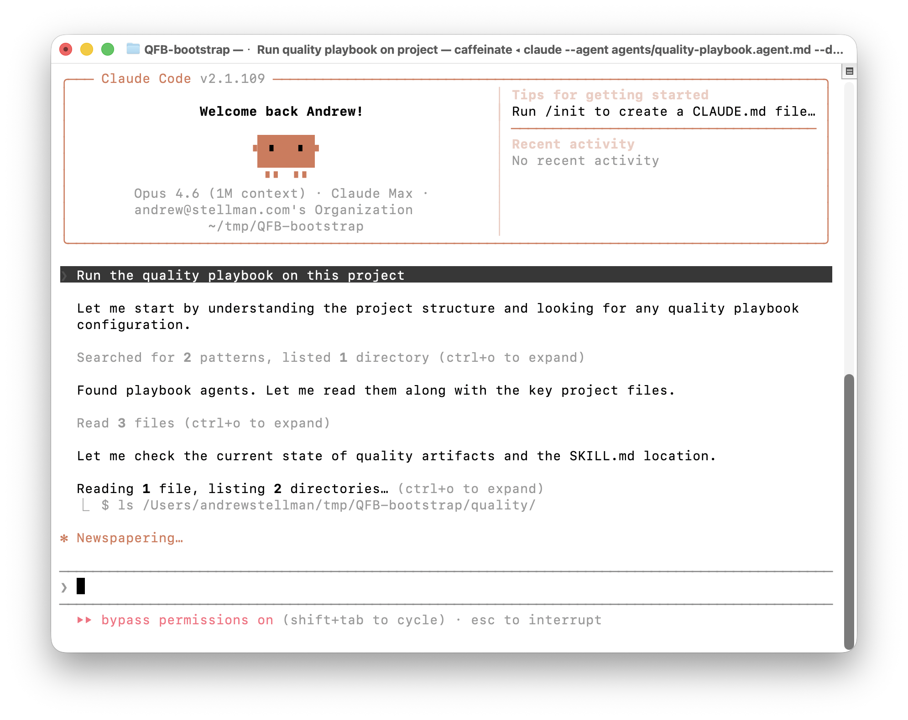
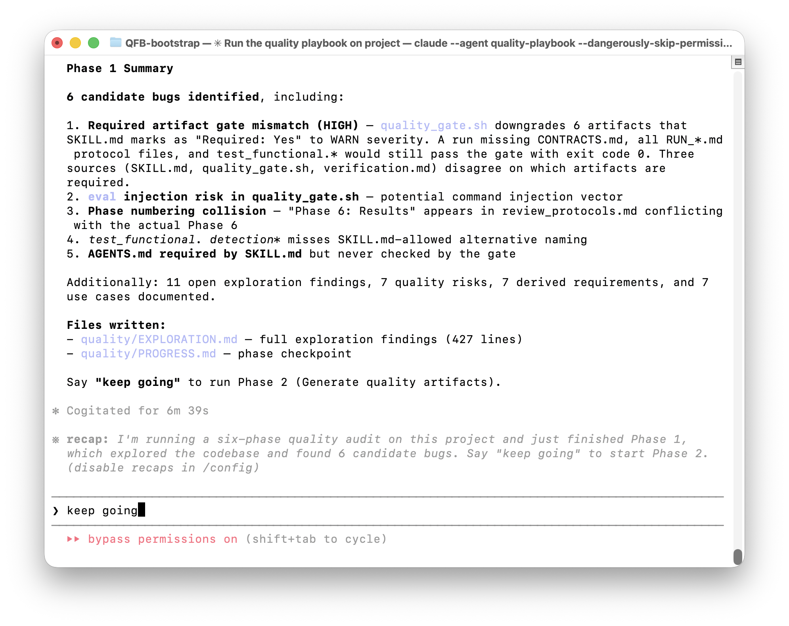
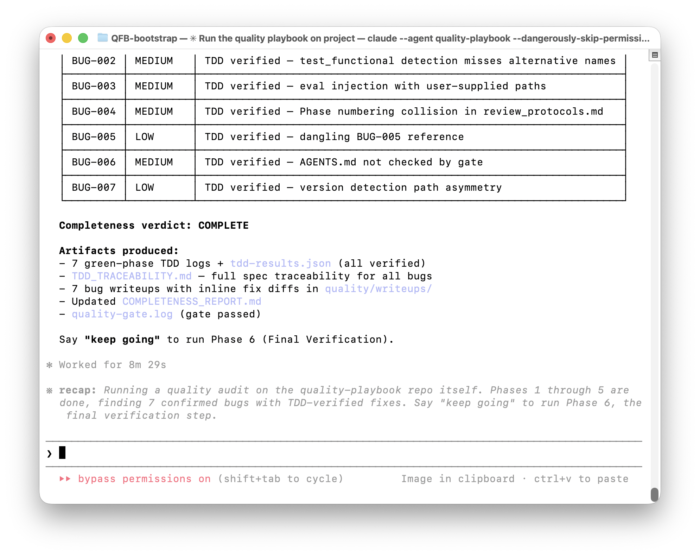
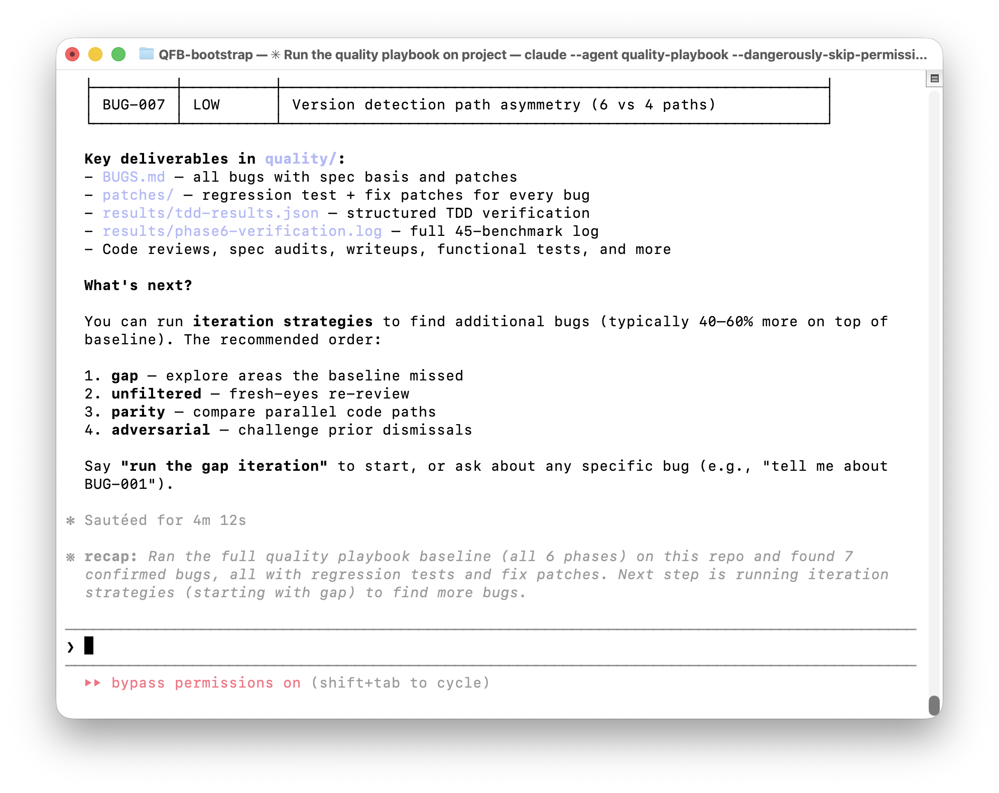
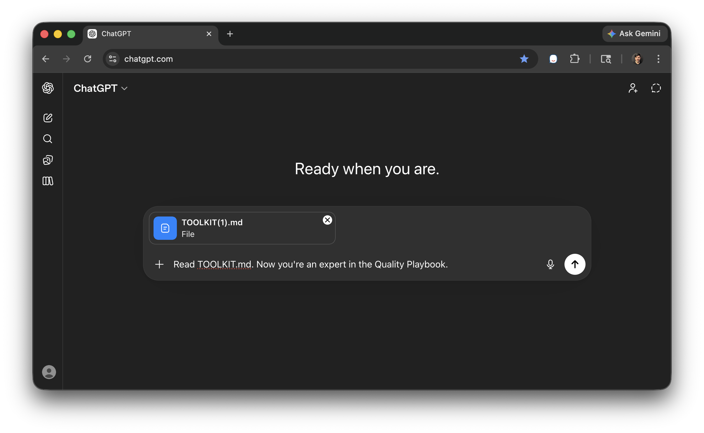

# Quality Playbook

Point an AI coding tool at any codebase. Get a complete quality engineering infrastructure: requirements derived from the actual intent of the code, functional tests traced to those requirements, a three-pass code review protocol, and a multi-model spec audit that catches bugs no single reviewer can find alone.

**Version:** 1.5.3 | **Author:** [Andrew Stellman](https://github.com/andrewstellman) | **License:** Apache 2.0

## Find the 35% of bugs that code review misses

Most AI code review can only find structural issues: null dereferences, resource leaks, race conditions. That catches about 65% of real defects. The other 35% are intent violations -- bugs that can only be found if you know what the code is *supposed* to do. A function that silently returns null instead of throwing, a duplicate-key check that passes when the first value is null, a sanitization step that runs after the branch decision it was supposed to guard. These bugs look correct to any reviewer that doesn't know the spec.

The playbook closes that gap. It reads your codebase, derives behavioral requirements from every source it can find (code, docs, specs, comments, defensive patterns, community documentation), and uses those requirements to drive review. The result is a quality system grounded in intent, not just structure. For a deeper look at this problem, see the O'Reilly Radar article [AI Is Writing Our Code Faster Than We Can Verify It](https://www.oreilly.com/radar/ai-is-writing-our-code-faster-than-we-can-verify-it/).

## How to use the Quality Playbook to find bugs in your code

### Step 1: Provide documentation (strongly recommended)

The playbook produces better requirements, fewer false positives, and more specific
bugs when it has written documentation to work from. Plaintext files only —
`.txt` and `.md`. Convert other formats first:

- `pdftotext spec.pdf spec.txt`
- `pandoc -t plain spec.docx -o spec.txt`
- `lynx -dump https://example.org/spec.html > spec.txt`

**Where to put documentation in your target repo:**

    reference_docs/
    ├── claude-chat-2026-03-15.md    ← AI chat logs, design notes (Tier 4 context)
    ├── design-notes.md              ← exploratory writeups, retrospectives
    ├── incident-2026-02-retro.md    ← post-mortems, lessons learned
    └── cite/
        ├── my-project-spec.md       ← your project's own spec (citable)
        └── rfc7807.txt              ← external standards you cite (citable)

**Top-level `reference_docs/`** holds Tier 4 context — chat logs, design notes,
retrospectives, any exploratory material. The playbook reads these into Phase 1
as background but does not byte-verify quotes from them.

**`reference_docs/cite/`** holds citable material — specs, RFCs, API contracts,
published standards. Every file here produces a `FORMAL_DOC` record with a
mechanical citation excerpt that `quality_gate.py` byte-verifies. If you cite
it in a BUG or REQ, the gate checks the quote matches the bytes on disk.

You do not need a sidecar file, a frontmatter header, or any metadata.
Placement in `cite/` is the flag that says "this is citable." (Optional: the
first non-blank line of a `cite/` file may carry `<!-- qpb-tier: 2 -->` or
`# qpb-tier: 2` to mark it as Tier 2. Absent marker defaults to Tier 1.)

If you have no documentation at all, the playbook still runs. It will operate
from the source tree alone (Tier 3 evidence) and produce Tier 5 inferred
requirements. The results are weaker but valid.

**What does not belong in reference_docs:**

- Binary or formatted files (PDF, DOCX, HTML) — convert first, commit plaintext
- Code excerpts — the source tree is already Tier 3 authority
- Test fixtures or sample data — these are project artifacts, not documentation
- Anything private or sensitive that should not be read by an LLM — `reference_docs/`
  contents are loaded into Phase 1 prompts

### Step 2: Install the skill

Copy the skill files into your project:

**Claude Code:**
```bash
mkdir -p .claude/skills/quality-playbook/references
cp SKILL.md .claude/skills/quality-playbook/SKILL.md
cp references/* .claude/skills/quality-playbook/references/
# v1.5.2: single reference_docs/ tree at the target repo root.
# No README ships — cite/ contents are adopter-provided plaintext.
mkdir -p reference_docs reference_docs/cite
# Optional: append the suggested .gitignore rules for adopters (keeps bulk
# archived runs + reference_docs content out of version control while tracking
# the top-level RUN_INDEX.md).
cat skill-template.gitignore >> .gitignore
```

**GitHub Copilot (flat layout):**
```bash
mkdir -p .github/skills/references
cp SKILL.md .github/skills/SKILL.md
cp references/* .github/skills/references/
# v1.5.2: single reference_docs/ tree at the target repo root.
mkdir -p reference_docs reference_docs/cite
cat skill-template.gitignore >> .gitignore
```

**GitHub Copilot (nested layout):**
```bash
mkdir -p .github/skills/quality-playbook/references
cp SKILL.md .github/skills/quality-playbook/SKILL.md
cp references/* .github/skills/quality-playbook/references/
# v1.5.2: single reference_docs/ tree at the target repo root.
mkdir -p reference_docs reference_docs/cite
cat skill-template.gitignore >> .gitignore
```

**Cursor, Windsurf, other tools:** Use any of the locations above, or put `SKILL.md` and `references/` in your project root. The runner, gate, and orchestrator agents check all four locations — repo-root `SKILL.md`, Claude's `.claude/skills/quality-playbook/`, and both Copilot layouts.

**OpenAI Codex CLI:** v1.5.3 adds the standalone [codex CLI](https://github.com/openai/codex) (codex-cli 0.125+) as a third runner alongside claude and copilot. No separate skill-install layout — codex runs the playbook from any of the locations above. To use it via `bin/run_playbook.py`, pass `--codex` (see Step 3 + the "Running everything autonomously" section below).

### Step 3: Run the playbook

**Claude Code:**
```bash
claude --agent agents/quality-playbook.agent.md
```
Add `--dangerously-skip-permissions` to skip file-write approval prompts.

**GitHub Copilot:** Open the chat panel in VS Code, IntelliJ, or any IDE with Copilot support and say: *"Run the quality playbook on this project."* For the CLI, use `copilot-cli` with `--yolo` to skip prompts.

**OpenAI Codex CLI:**
```bash
python3 bin/run_playbook.py --codex ./my-project
```
This invokes `codex exec --full-auto` (sandboxed automatic execution; the codex equivalent of `gh copilot --yolo`) for each playbook phase. Codex picks its model from `~/.codex/config.toml` unless you pass `--model gpt-5-codex` (or another model name in your codex config).

**Cursor:** Open Composer (Cmd+I / Ctrl+I) and say: *"Read SKILL.md and run the quality playbook on this project."*

**Windsurf:** Open Cascade and say: *"Read SKILL.md and run the quality playbook on this project."*

<a href="images/claude-code-bootstrap-2.png"></a>

The playbook runs in six phases. Each phase gets its own context window — this is what lets it do deep analysis instead of running out of context on large codebases. After each phase, say "keep going" to continue.

<a href="images/claude-code-bootstrap-2.png"></a>

*After Phase 1, the playbook reports candidate bugs and tells you what to say next.*

<a href="images/claude-code-bootstrap-4.png"></a>

*Phase 5 confirms every bug with TDD red-green verification and generates fix patches.*

<a href="images/claude-code-bootstrap-5.png"></a>

*The final summary shows all confirmed bugs with regression tests, patches, and writeups.*

The six phases: **Explore** (read code + docs, find candidates) → **Generate** (requirements, tests, protocols) → **Code Review** (three-pass: structural, requirement verification, cross-requirement consistency) → **Spec Audit** (three independent auditors check code against requirements) → **Reconciliation** (every bug tracked, regression-tested, TDD-verified) → **Verify** (45 self-check benchmarks). The full cycle takes 15-90 minutes depending on project size and works with any language.

### Step 4: Run iterations

After the baseline, the playbook suggests iteration strategies that find different classes of bugs — typically 40-60% more on top of the baseline. Say *"Run the next iteration using the gap strategy"* to start, then follow the suggested order: gap → unfiltered → parity → adversarial.

### Running everything autonomously

To run the full baseline and all four iterations without manual intervention:

**Claude Code:**
```bash
claude --agent agents/quality-playbook-claude.agent.md --dangerously-skip-permissions -p \
  "Run the full quality playbook with all iterations. Run each phase as a separate
   sub-agent, then run all four iteration strategies (gap, unfiltered, parity,
   adversarial) in sequence, each as a separate sub-agent. Do not stop between
   phases or iterations — run everything end to end."
```

To capture the output to a log file, add `2>&1 | tee playbook-run.log` to the end.

**Via `bin/run_playbook.py` (any runner):** the Python orchestrator at `bin/run_playbook.py` accepts a runner-selection flag — pick one of `--claude` / `--copilot` (default) / `--codex`. Example: `python3 bin/run_playbook.py --codex ./my-project` runs all six phases via `codex exec --full-auto`. Use `--model <name>` to override the runner's default model (codex picks from `~/.codex/config.toml` when no `--model` is passed).

This uses the orchestrator agent (`quality-playbook-claude.agent.md`), which spawns a separate sub-agent for each of the six phases and each of the four iteration strategies. Each sub-agent gets its own context window, communicates with the others through files on disk (`quality/PROGRESS.md`, `quality/BUGS.md`, etc.), and exits when its phase is complete. The orchestrator reads the results and launches the next sub-agent.

Three things in the prompt matter:

**"Run each phase as a separate sub-agent"** — this is the most important part. Each phase needs the full context window for deep analysis. If the agent tries to run multiple phases in a single context, it runs out of room partway through Phase 3 on most projects, producing shallow analysis and fewer bugs. Separate sub-agents mean each phase gets ~200K tokens of context for investigation.

**"All four iteration strategies in sequence"** — iterations re-explore the codebase with different approaches: gap (areas the baseline missed), unfiltered (pure domain-driven exploration without structural constraints), parity (compare parallel code paths), and adversarial (challenge prior dismissals). Each strategy finds a different class of bug. Running all four typically adds 40-60% more confirmed bugs on top of the baseline.

**"Do not stop between phases or iterations"** — by default, the playbook pauses after each phase and waits for the user to say "keep going." This is useful when you want to review intermediate results, but for an autonomous run you want it to continue through all ten sub-agents (six phases + four iterations) without interruption.

The full autonomous run takes 60-180 minutes depending on codebase size and model. Add `--model sonnet` or `--model opus` to choose a specific model.

### Step 5: Fix bugs, then recheck

After fixing the bugs from BUGS.md, say *"recheck"* to verify your fixes. Recheck mode reads the existing bug report, checks each bug against the current source (reverse-applying patches, inspecting cited lines), and reports which bugs are fixed vs. still open. Takes 2-10 minutes instead of re-running the full pipeline.

## Running the playbook: phases, iterations, and macros

`bin/run_playbook.py` exposes three invocation modes:

**Mode 1 — Single baseline run (default):**

    python3 bin/run_playbook.py ./my-project

Runs Phase 1 through Phase 6 in sequence on one target.

**Mode 2 — Explicit iteration list:**

    python3 bin/run_playbook.py --iterations gap,unfiltered,parity,adversarial ./my-project

Runs baseline + the listed iteration strategies in order. **Early-stop is disabled** when `--iterations` is explicit — every strategy in the list runs regardless of prior yields.

**Mode 3 — `--full-run` macro:**

    python3 bin/run_playbook.py --full-run ./my-project

Equivalent to baseline + all four iteration strategies (`gap`, `unfiltered`, `parity`, `adversarial`) in order, **with early-stop enabled.** If yields drop below the threshold, remaining iterations are skipped.

Use Mode 2 when you want to force all four strategies to run even if early-stop would trigger. Use Mode 3 for unattended runs where you're happy to save budget on clearly-exhausted cycles.

## Rate limits and run budgets

- **GitHub Copilot GPT-5.4:** Copilot enforces a 54-hour cooldown on ~15M-token prompts. Plan benchmark re-runs accordingly — the casbin-1.5.1 incident locked out GPT-5.4 for two days mid-release.
- **Claude Code plan budget:** a full run of the playbook on a 50K-LOC project typically consumes ~30% of a Sonnet-family monthly budget. Budget surges during Phase 4 (Spec Audit, three parallel auditors) and Phase 5 (TDD red-green verification on many bugs).
- **Reference-doc scaling:** the playbook reads all of `reference_docs/` into Phase 1 context. Keep it under ~2M tokens to avoid context-budget pressure on downstream phases. For very large specs, curate the excerpts that are actually cited rather than dumping full RFCs.

### Why phases?

The playbook runs each phase in a separate context window on purpose. A single-session approach runs out of context partway through Phase 3 on most projects, which means shallow analysis and missed bugs. The phase-by-phase design gives each phase the full context budget for deep investigation. The tradeoff is saying "keep going" a few times — or use the autonomous mode above to skip the manual steps entirely.

## Need help? Just ask your AI

You don't need to read the documentation to use the Quality Playbook — your AI coding tool can read it for you. The [`ai_context/TOOLKIT.md`](https://github.com/andrewstellman/quality-playbook/blob/main/ai_context/TOOLKIT.md) file explains everything about the playbook in a format designed for AI assistants to read and answer questions about.

Open a chat in any AI tool — Claude Code, Cursor, GitHub Copilot, ChatGPT, Gemini, whatever you use — attach [`ai_context/TOOLKIT.md`](https://github.com/andrewstellman/quality-playbook/blob/main/ai_context/TOOLKIT.md) and tell it:

> "Read TOOLKIT.md. Now you're an expert in the Quality Playbook."

<a href="https://chatgpt.com/share/69dee323-1f34-832f-aa98-06e606aff1d0"></a>

Then ask it anything you want. How do I set this up? What does Phase 3 actually do? How does it find bugs that structural code review misses? What's the difference between gap and adversarial iteration? Why did my run only find one bug? Ask as many questions as you want — the toolkit has detailed explanations of every technique, every phase, and every iteration strategy. Your AI assistant will walk you through setup, running, interpreting results, and improving your next run.

[Here's what that conversation looks like in ChatGPT](https://chatgpt.com/share/69dee323-1f34-832f-aa98-06e606aff1d0) — it works just as well in Claude, Copilot, Gemini, or any other AI coding tool.

## What the playbook produces

The playbook generates these files:

| Artifact | Location | What it does |
|----------|----------|-------------|
| `REQUIREMENTS.md` | `quality/` | Behavioral requirements derived from code, docs, and community sources via a five-phase pipeline. This is the foundation -- without requirements, review is limited to structural bugs. |
| `QUALITY.md` | `quality/` | Quality constitution defining what "correct" means for this specific project, with fitness-to-purpose scenarios and coverage theater prevention. |
| `test_functional.*` | `quality/` | Functional tests in the project's native language, traced to requirements rather than generated from source code. |
| `RUN_CODE_REVIEW.md` | `quality/` | Three-pass protocol: structural review, requirement verification, cross-requirement consistency. Each pass finds bugs the others can't. |
| `RUN_SPEC_AUDIT.md` | `quality/` | Council of Three: three independent AI models audit the code against requirements. Different models have different blind spots, and the triage uses confidence weighting, not majority vote. |
| `RUN_INTEGRATION_TESTS.md` | `quality/` | End-to-end test protocol grounded in use cases, with a traceability column mapping each test to the user outcome it validates. |
| `RUN_TDD_TESTS.md` | `quality/` | Red-green TDD verification protocol: for each confirmed bug, prove the regression test fails on unpatched code and passes with the fix. |
| `BUGS.md` | `quality/` | Consolidated bug report with spec basis, severity, reproduction steps, and patch references for every confirmed finding. |
| `AGENTS.md` | project root | Bootstrap file so every future AI session inherits the full quality infrastructure. |

## How it works

The playbook's value comes from requirement derivation. AI code reviewers are bottlenecked by the same thing human reviewers are: if you don't know what the code is *supposed* to do, you can only find structural issues. The playbook's main job is figuring out intent, then using that intent to drive every downstream artifact.

**Phase 1: Explore.** The AI reads source files, tests, config, specs, and commit history. If you provide community documentation (GitHub issues, user guides, API docs, forum discussions), it reads those too. The goal is to understand not just what the code does, but what it's supposed to do.

**Phase 2: Generate.** A five-phase pipeline extracts behavioral contracts from the codebase, derives testable requirements, verifies coverage, checks completeness, and adds a narrative layer with validated use cases. The pipeline also generates functional tests, review protocols, a TDD verification protocol, and the quality constitution.

**Phase 3: Code review.** A three-pass code review runs against HEAD: structural review with anti-hallucination guardrails, requirement verification checking each requirement against the code, and cross-requirement consistency checking whether requirements contradict each other. About 65% of findings come from Pass 1, 35% from Passes 2 and 3. Each confirmed bug gets a regression test.

**Phase 4: Spec audit.** Three independent AI models audit the code against the requirements. The triage process uses verification probes -- targeted checks that ask "is this actually true?" -- rather than dismissing single-model findings. As of v1.3.17, verification probes must produce executable test assertions (not just prose reasoning) to confirm or reject findings, which prevents the triage from hallucinating code compliance. The most valuable findings are often the ones only one model catches.

**Phase 5: Reconciliation.** Post-review reconciliation closes the loop: every bug from code review and spec audit is tracked, regression-tested or explicitly exempted, and the completeness report is finalized with one authoritative verdict.

**Phase 6: Verify.** 45 self-check benchmarks validate the generated artifacts against internal consistency rules -- requirement counts match across all surfaces, no stale text remains, every finding has a closure status, and triage probes include executable evidence.

### Why documentation matters

Adding community documentation to the pipeline produces measurably better results. In a controlled experiment across multiple repositories, documentation-enriched runs found more bugs, different bugs, and higher-confidence bugs than code-only baselines. The documentation gives auditors spec language to check against, turning "this code looks odd" into "this code contradicts the documented behavior."

### What's new in v1.5.3

- **Skill-as-code feature complete.** v1.5.3 extends the v1.5.0 divergence model to AI-skill targets — projects where SKILL.md prose IS the spec (no separate implementation). The originating evidence was the **2026-04-19 Haiku demonstration**: claude-haiku-4-5-20251001 generated a 2,129-line REQUIREMENTS.md against QPB's own SKILL.md from a simple two-turn interaction, demonstrating that earlier QPB releases were leaving substantial skill-prose coverage on the table because the heuristic pipeline was tuned for code projects.
- **Phase 0 project-type classifier.** `bin/classify_project.py` classifies every target as **Code**, **Skill**, or **Hybrid** based on a SKILL.md-prose-vs-code-LOC ratio with explicit override hooks for Council triage. Code targets continue through the v1.5.0 divergence pipeline unchanged; Skill / Hybrid targets get the new four-pass derivation pipeline. Council override workflow at [`docs/design/QPB_v1.5.3_Phase4_Council_Override_Workflow.md`](docs/design/QPB_v1.5.3_Phase4_Council_Override_Workflow.md).
- **Four-pass generate-then-verify skill-derivation pipeline.** Pass A (naive coverage, section-iterative) reads SKILL.md + every `references/*.md` file with high-recall LLM extraction. Pass B (mechanical citation extraction with token-overlap pre-filter) cuts the O(n×m) similarity match by ~93× via a Jaccard pre-filter (Round 6 follow-up, applied at v1.5.3 to keep cross-target wall-clock tractable). Pass C (formal REQ + UC production) applies the v1.5.3 disposition table with project-type-aware behavioral routing. Pass D (coverage audit + Council inbox) emits per-section accounting + a structured triage queue.
- **Skill-divergence taxonomy: internal-prose, prose-to-code, execution.** `BUG.divergence_type` extends to four values per `schemas.md` §3.8. Phase 4's detection machinery covers all three skill-divergence categories with a precision-tuned pipeline (four-prong filter for internal-prose, Tier-1-mechanical + Tier-2-LLM split for prose-to-code, archived-gate-result aggregation for execution). The detection ships under `bin/skill_derivation/divergence_*.py`.
- **Skill-project gate enforcement.** Four new gate checks in `quality_gate.py` (`check_skill_section_req_coverage`, `check_reference_file_req_coverage`, `check_hybrid_cross_cutting_reqs`, `check_project_type_consistency`) verify Skill/Hybrid invariants. Code projects SKIP the skill-specific checks rather than failing on them — the v1.5.3 surface is additive against Code-project gates.
- **Curated REQUIREMENTS.md bootstrap.** v1.5.3's self-audit produces a curated REQUIREMENTS.md with **comparable coverage** to the Haiku reference (~65 unique REQ definitions in the published Haiku artifact; v1.5.3's curated output renders at 171 REQs across 171 sections, sub-agent spot-check folded into the bootstrap commit). The curation algorithm groups by section, dedupes via Jaccard at 0.6 threshold, and caps at K REQs per partition. See `previous_runs/v1.5.3/REQUIREMENTS.md`.
- **Cross-target validation: 5 code regression + QPB Hybrid + 3 pure skills.** Phase 5 captured pre-v1.5.3 BUGS.md snapshots for chi-1.5.1, virtio-1.5.1, express-1.5.1, cobra-1.3.46, and ran v1.5.3 against three pure-skill targets (anthropic-skills/skills/skill-creator, pdf, claude-api). All three pure-skill cells classify as Skill, run cleanly through Phase 3 + Phase 4, and produce zero false-positive divergences after the Stage 1 precision tuning. The full code-target playbook regression sweep + cross-model second backend (opus) are deferred to a v1.5.3.1 patch.
- **Backward compatibility verified.** `python3 -m bin.classify_project --benchmark` returns `## Overall: PASS` for all 6 cells (5 code + QPB). Phase 4's skill-specific checks SKIP cleanly on Code projects; no `bin/run_playbook.py` changes shipped in v1.5.3.

Originating evidence and the full bootstrap archive (1369 formal REQs + 17 UCs + 11 internal-prose divergences + 4 LLM-judged prose-to-code divergences + 8 partition-density warnings + the curated REQUIREMENTS.md) live under `previous_runs/v1.5.3/`. Phase summaries: `quality/phase3/PHASE3B_SUMMARY.md`, `PHASE4_SUMMARY.md`, `PHASE5_SUMMARY.md`.

### What's new in v1.5.2

- **Two full Council-of-Three reviews cleared the release.** v1.5.2 went through two nine-panelist nested-panel reviews — Round 7 against the C13.6–C13.9 implementation surface, Round 8 against the C13.10 release-prep fixes. Round 8 was 8/9 ship + 1 block on a structural test-discipline issue (logged for v1.5.3). Synthesis docs at `Quality Playbook/Reviews/QPB_v1.5.2_Council_Round{7,8}_Synthesis.md` in the workspace.
- **Orchestrator-side authoritative finalization (C13.9).** A new `_finalize_iteration` helper in `bin/run_playbook.py` runs `quality_gate.py` as a subprocess after each iteration, captures real gate output to `quality/results/quality-gate.log`, and writes a structured block to `PROGRESS.md` with the verdict mapped into INDEX.md's `gate_verdict` field. This closes the v1.5.1 failure mode where the orchestrator's success path took the LLM's word for finalization rather than running the gate itself, producing stale `quality-gate.log` files (chi: 13 vs actual 15 bugs after parity) and silent half-state PROGRESS.md.
- **Cardinality gate hardening (C13.8).** Three Round 6 findings closed with regression tests: `_EVIDENCE_RE` rejects absolute paths and zero-line/zero-range citations; the `present` boolean field is strict-type-checked (no string `"true"` or integer `1` slipping through); `_parse_tier_marker` distinguishes body-prose mentions of `qpb-tier` from misplaced markers, so a doc that says "this file uses qpb-tier markers" no longer fails ingest.
- **Citation verifier hardening (C13.6).** `bin/citation_verifier.py` adds the `reference_docs/cite/` extension check, tier marker semantics, downgrade-record skip handling, and `present:true` evidence enforcement. Citation-stale detection now runs end-to-end: producer writes the document hash, consumer reads it, mismatches are caught when source files change post-ingest.
- **Schema contract fix — `document_sha256` (C13.10 Finding D).** `bin/reference_docs_ingest.py` now writes `document_sha256` matching the schema. Previously the producer wrote `sha256` while the gate read `document_sha256`, silently disabling the stale-citation invariant.
- **Phase 6 verdict-mapping guard (C13.10 Finding B).** A `fail` finalizer status no longer demotes to `partial` just because the gate log's last line happens to contain the substring "warn". Definite gate failures are now correctly recorded as `fail` in INDEX.
- **CLI parsing fix — `--flag=value` form (C13.10 Finding F).** `_mark_iterations_explicit` now handles argparse's combined-token form (`--strategy=adversarial`), not just the split-token form (`--strategy adversarial`). Users running with `=` syntax no longer silently fall through to the zero-gain early-stop default.
- **SKILL.md version stamps consistent (C13.10 Finding E).** All inline version references in SKILL.md updated to v1.5.2; a CI guard at `bin/tests/test_run_playbook.py:test_skill_version_matches_release_constant` fails loudly if a future release-prep misses the bump.
- **New orientation docs.** Three companion files now describe how the playbook is itself maintained: [`ai_context/IMPROVEMENT_LOOP.md`](ai_context/IMPROVEMENT_LOOP.md) (canonical methodology — PDCA loop, verification dimensions vs improvement levers, regression replay), [`ai_context/TOOLKIT_TEST_PROTOCOL.md`](ai_context/TOOLKIT_TEST_PROTOCOL.md) (release-gate review for orientation docs via 14 reader personas with PASS/DOC GAP/DOC WRONG/PANELIST DRIFT rubric), and a "How we improve the playbook" section in this README.
- **Honest statistical-control framing.** IMPROVEMENT_LOOP.md commits to a "moving toward statistical control" framing — instrumented and trend-aware, not yet under formal SPC. Cross-repo analysis of 197 BUGS.md files across 39 QPB versions confirmed within-version variance is large (chi-1.5.1: 9 vs 15 bugs across N=2 replicates, ~50% of mean), supporting conservative public-facing language: per-version trends are recorded, but adjacent-release comparisons of ±2 bugs should not be interpreted as real movement.
- **Submit-upstream workflow guidance (TOOLKIT.md).** New section explains the workflow for adopters who want to submit findings as upstream PRs: tier triage (standout / confirmed / probable / candidate), writeup-as-PR-body, regression-test patch portability, honest attribution framing ("AI-assisted" not "AI generated"), and defect-class consolidation (one consolidated PR vs N individual PRs for the same root-cause defect family). New Personas 14 (PR-submitter walkthrough) and 17 (defect-class consolidation) added to the Toolkit Test Protocol active set.
- **C13.11 cleanup pass queued for v1.5.3.** Six non-blocking hardening items surfaced in Round 8 are documented in IMPROVEMENT_LOOP.md for cleanup as a single commit early in v1.5.3 (centralize `RELEASE_VERSION` constant, extend version-stamp test to `detect_repo_skill_version()`, audit comment for `_mark_iterations_explicit`, mutation-integration test for citation_stale, sys.path cleanup, Phase 6 verdict matrix completion).

### What's new in v1.5.1

- **Phase 5 writeup hardening.** `bin/run_playbook.py::phase5_prompt()` now carries a MANDATORY HYDRATION STEP with a BUGS.md → writeup field map, a worked BUG-004 example, and a per-writeup confirmation checklist that prohibits empty backticks, empty diff fences, and angle-bracket placeholders. This closes the Phase 5 failure mode observed on `bus-tracker-1.5.0`, where the playbook produced skeletal writeups that passed the legacy gate despite having no file paths, no line ranges, no inline diffs, and no regression-test references.
- **Quality-gate writeup hydration checks.** `check_writeups` in `.github/skills/quality_gate/quality_gate.py` now fails when any writeup contains one of five template-sentinel strings (the stub language from `phase5_prompt()`'s pre-hydration template) or when a ` ```diff ` fence is present but contains no `+` / `-` lines other than file headers. Stub writeups can no longer slip past the gate by leaving template scaffolding intact.
- **Case-insensitive diff fence detection.** The hydration gate recognises ` ```diff `, ` ```Diff `, and ` ```DIFF ` uniformly via `_WRITEUP_DIFF_BLOCK_RE`, so inline-diff presence and content checks can't disagree on whether a fence exists. Previously a writeup with a mixed-case fence would trip a confusing "no inline fix diffs" FAIL despite containing a visible unified diff.
- **Quality-gate tests.** New unit-test coverage for sentinel detection and empty-diff-fence detection lands alongside the gate changes, extending the existing quality-gate test suite.

### What's new in v1.4.6

- **27 bugs fixed from the v1.4.5 bootstrap self-audit.** The Opus self-audit over v1.4.5 baseline + four iteration strategies (gap, unfiltered, parity, adversarial) confirmed 27 real defects spanning version parsers, phase entry gates, archive atomicity, runner reliability, quality-gate validation, prompt portability, and orchestrator bootstrap. All 27 shipped as fixes with passing regression tests; recheck reports 27/27 FIXED. Shipped in seven thematic commits. Highlights: the Phase 2 gate now FAILs below 120 lines instead of WARNing at 80 (matching SKILL.md §Phase 1 completion gate); the Phase 3 gate checks all nine Phase 2 artifacts instead of four; the Phase 5 gate enforces SKILL.md's hard-stop (`*triage*` + `*auditor*` files + Phase 4 `[x]`); `archive_previous_run` stages into a `.partial` subfolder under the runs archive and then atomically renames, preserving `control_prompts/` content instead of deleting it; `cleanup_repo` adds `AGENTS.md` to the protected-path set; child-process exit codes propagate through `run_one_phase` / `run_one_singlepass`; missing `docs_gathered/` WARNs and continues with code-only analysis instead of blocking; runner prompts now advertise all four documented install paths via a new `SKILL_FALLBACK_GUIDE` constant; `check_run_metadata` and `_check_exploration_sections` plug two long-standing gate gaps; `validate_iso_date` accepts ISO 8601 datetimes; `_parse_porcelain_path` unwraps Git's quoted paths; `detect_project_language` skips nested benchmark fixture repos. Full per-bug detail in `quality/results/recheck-summary.md`.
- **Bootstrap artifacts tracked in git.** The `quality/` tree — including archived prior runs under `quality/runs/` and per-phase prompt output under `quality/control_prompts/` — is in version control as project history. Earlier it was untracked to avoid `cleanup_repo`'s `git checkout .` wiping it; now `cleanup_repo` protects `quality/` explicitly, so the tree can be tracked without risk. Future iterations can diff against it. (Pre-v1.5.1 releases used root-level `previous_runs/` and `control_prompts/` directories; v1.5.1's `bin/migrate_v1_5_0_layout.py` moves those into `quality/` as part of the consolidated layout.)

### What's new in v1.4.5

- **Python runner with a path-based interface.** `bin/run_playbook.py` treats every positional argument as a directory path (relative or absolute) and defaults to the current directory when none are given. No more short-name resolution, no hardcoded `repos/` lookups — the runner works against any project you point it at. A narrow version-append fallback kicks in only for bare names (no path separators): if `chi` isn't a directory, the runner retries `chi-<skill_version>` once, using the `version:` line from `SKILL.md`. Log files live next to each target (`{parent}/{target-name}-playbook-{timestamp}.log`). Missing SKILL.md is a warning, not a fatal error, so first-time installs aren't blocked. 36 stdlib-only unit tests at release (grew to 92 with v1.4.6 regression coverage).
- **Python gate is the sole mechanical gate.** `quality_gate.sh` has been retired. `quality_gate.py` now handles JSON with `json.load` instead of grep-style parsing and lives at `.github/skills/quality_gate/` as a proper package with a 108-test unit-test suite. A stable symlink at `.github/skills/quality_gate.py` preserves the previous invocation path.
- **Benchmark set reduced to four targets** — bootstrap, chi, cobra, virtio — so full validation loops finish in a reasonable window. Bootstrap always runs last because fixes from the other three need to land before the playbook audits itself.
- **Rate limit warning added.** The README and runner docs now call out that running many targets in parallel with single-prompt mode can trigger multi-day Copilot cooldowns; `--phase all` with `--sequential` is the recommended mode.

### What's new in v1.4.4

- **Orchestrator hardening — "you are the orchestrator" architecture.** Motivated by failures on the casbin run, the orchestrator agents now explicitly forbid three failure modes: single-context collapse (running all six phases in one context window), `claude -p` subprocess spawning (forking new CLI sessions instead of using the Agent tool), and nested Agent-tool stripping (sub-agents trying to spawn their own sub-agents, which Claude Code silently strips). The session reading the agent file IS the orchestrator — it spawns one sub-agent per phase and nothing else.
- **Shared orchestrator protocol.** The hardening rules now live in `references/orchestrator_protocol.md` and are imported by both `agents/quality-playbook-claude.agent.md` and `agents/quality-playbook.agent.md`. Critical rules are also duplicated inline in each agent file so a partial read still enforces them.

### What's new in v1.4.3

- **Challenge gate for false-positive detection.** Before closure, the triage must re-review CRITICAL findings against common-sense reality checks. Motivated by edgequake benchmarking, where six "CRITICAL" tenant-isolation bugs turned out to be documented feature gaps and a seventh was a self-documenting `change-me-in-production` development placeholder. The gate forces that common-sense review to happen before findings are finalized.
- **Functional-test reference reorganized.** Per-language functional-test guidance was split into separate reference files, then re-merged back into a single `references/functional_tests.md` with the import patterns folded in. Easier to maintain, easier for agents to read.

### What's new in v1.4.2

- **25 bug fixes from Sonnet 4.6 bootstrap self-audit.** Fixed nullglob-vulnerable artifact detection across 7 locations (ls-glob replaced with find), severity-prefixed bug ID support (BUG-H1/BUG-M3/BUG-L6), TDD sidecar-to-log cross-validation, recheck-results.json gate validation, Phase 5 entry gate, and integration enum validation. All verified by recheck (25/25 FIXED).
- **Run metadata for multi-model comparison.** Every playbook run creates a timestamped `quality/results/run-YYYY-MM-DDTHH-MM-SS.json` recording model, provider, runner, timestamps, phase timings, bug counts, and gate results. Enables comparison across models and runs.
- **Sonnet recommended as default model.** Sonnet 4.6 found 25 bugs (3 HIGH) at ~3% weekly usage vs Opus's 19 bugs (1 HIGH) at ~8%. More bugs, more HIGH severity, lower cost.

### What's new in v1.4.1

- **Recheck mode.** After fixing bugs, say "recheck" to verify fixes without re-running the full pipeline. Reads the existing BUGS.md, checks each bug against the current source (reverse-applying patches, inspecting cited lines), and outputs machine-readable results to `quality/results/recheck-results.json`. Takes 2-10 minutes instead of 60-90.
- **19 bug fixes from bootstrap self-audit.** Fixed eval injection in quality_gate.sh, bash 3.2 empty array crashes, required artifacts downgraded to WARN, json_key_count false positives, missing artifact checks, and documentation inconsistencies. All verified by recheck (19/19 FIXED).

### What's new in v1.4.0

- **Six-phase architecture with clean context windows.** The playbook now runs as six distinct phases (Explore, Generate, Review, Audit, Reconcile, Verify), each designed to execute in a separate session with its own context window. Phase prompts include exit gates that verify prerequisites before starting and artifact completeness before finishing. This eliminates context-window exhaustion on large codebases and makes each phase independently re-runnable.
- **Phase-by-phase runner with `--phase` flag.** The standard-library Python runner at `bin/run_playbook.py` supports `--phase all` (run phases 1-6 sequentially with gates between each), `--phase 3` (run a single phase), or `--phase 3,4,5` (run a range). Each invocation gets a fresh CLI session, communicating through files on disk.
- **Four iteration strategies.** After the baseline run, the playbook supports four iteration strategies that find different classes of bugs: gap (explore areas the baseline missed), unfiltered (fresh-eyes re-review), parity (parallel path comparison), and adversarial (challenge prior dismissals and recover Type II errors). Iterations consistently add 40-60% more confirmed bugs on top of the baseline.
- **TDD red-green verification for every confirmed bug.** Every bug in BUGS.md must have a regression test patch, a red-phase log proving the test detects the bug on unpatched code, and a green-phase log proving the fix resolves it. The `tdd-results.json` sidecar (schema 1.1) tracks all verdicts with machine-readable fields.
- **Quality gate script.** A mechanical validation script (originally `quality_gate.sh`, now `quality_gate.py`) validates artifact completeness: patch files, writeups, TDD logs, JSON schema conformance, version stamps, and BUGS.md heading format. Runs as the final Phase 6 step.
- **Benchmark results across three codebases.** Validated against Express.js (14 confirmed bugs), Gson (9 confirmed bugs), and Linux virtio (8 confirmed bugs), all with 100% TDD red-phase coverage and 0 gate failures.

### What's new in v1.3.20

- **Mechanical verification artifacts with integrity check (council-recommended).** Before CONTRACTS.md can assert that a dispatch function handles specific constants, you must generate and execute a shell pipeline (awk/grep) that extracts actual case labels from the function body, saving to `quality/mechanical/<function>_cases.txt`. Each extraction command is also appended to `quality/mechanical/verify.sh`, which re-runs the same commands and diffs against saved files. Phase 6 must execute `verify.sh` — if any diff is non-empty, the artifact was tampered with. This integrity check was added because v1.3.19 testing showed the model can execute the correct command but write fabricated output to the file instead of letting the shell redirect capture it.
- **Source-inspection tests must execute (no `run=False`).** Regression tests that verify source structure (string presence, case label existence) are safe, deterministic, and must run. The `run=False` flag is banned for these tests. In v1.3.18, the correct assertion existed but never fired because `run=False` made it inert.
- **Contradiction gate.** Before closure, executed evidence (mechanical artifacts, regression test results, TDD red-phase failures) is compared against prose artifacts (requirements, contracts, triage, BUGS.md). If they contradict, the executed result wins — the prose artifact must be corrected before proceeding.
- **Effective council gating for enumeration checks.** If the council is incomplete (<3/3) and the run includes whitelist/dispatch checks, the audit cannot close those checks without mechanical proof artifacts.
- **Normative vs. descriptive contract language.** Requirements use "must preserve" (normative) unless a mechanical artifact confirms the claim, in which case "preserves" (descriptive) is allowed.
- **Self-contained iterative convergence.** New Phase 0 (Prior Run Analysis) builds a seed list from prior runs' confirmed bugs and mechanically re-checks each seed against the current source tree. After Phase 6, a convergence check compares net-new bugs against the seed list. When net-new bugs = 0, bug discovery has converged. When not converged, the skill automatically archives the current run to `quality/runs/` and re-iterates from Phase 0 — up to 5 iterations by default (configurable). No external scripts needed; the skill handles the full iteration loop internally with context-window awareness. A `run_iterate.sh` script is also available for shell-level orchestration.
- **45 self-check benchmarks** (up from 22).

## Validation

The playbook is validated against the [Quality Playbook Benchmark](https://github.com/andrewstellman/quality-playbook-benchmark): 2,564 real defects from 50 open-source repositories across 14 programming languages. Instead of injecting synthetic faults, we use real historical bugs tied to single fix commits as ground truth.

The key finding: approximately 65% of real defects are detectable by structural code review alone. The remaining 35% are intent violations that require knowing what the code is supposed to do. The playbook's value is in closing that gap.

## Setting up automation scripts

The repository includes a standard-library Python runner at `bin/run_playbook.py`.

Positional arguments are **directory paths** (relative or absolute). Omit positional args to run against the current directory. One convenience applies only to **bare names** (no path separators, no leading `.` / `..` / `~`): if `chi` isn't a directory, the runner retries `chi-<version>` using the `version:` line from `SKILL.md` at the QPB root. Path-like inputs (`./chi`, `/abs/chi`) are taken literally — no fallback.

```bash
cd my-project
python3 /path/to/quality-playbook/bin/run_playbook.py                      # run on cwd
python3 /path/to/quality-playbook/bin/run_playbook.py --phase all          # phase-by-phase on cwd
python3 /path/to/quality-playbook/bin/run_playbook.py ./project1 ./project2  # multiple targets
python3 /path/to/quality-playbook/bin/run_playbook.py --claude --model opus --phase all ./project1
python3 /path/to/quality-playbook/bin/run_playbook.py --next-iteration --strategy gap ./project1
```

For benchmark use, run from the `repos/` folder so relative paths resolve to the versioned working copies produced by `setup_repos.sh`:

```bash
cd repos
python3 ../bin/run_playbook.py --phase all --sequential chi-1.4.6
python3 ../bin/run_playbook.py chi     # resolves to chi-1.4.6 via SKILL.md version
```

**Rate limit warning:** Running multiple targets in parallel with single-prompt mode (no `--phase`) sends long autonomous prompts that consume large amounts of API quota. In testing, running 8 targets in parallel single-prompt mode triggered a 54-hour Copilot rate limit. Use `--phase all` instead — it runs each phase as a separate, shorter prompt with exit gates between phases. This uses less quota per prompt, produces better results (each phase gets a full context window), and is easier to resume if interrupted. For the same reason, prefer `--sequential` over `--parallel` unless you're confident in your rate limit headroom.

### Usage

```text
usage: run_playbook.py [-h] [--parallel | --sequential]
                       [--claude | --copilot | --codex]
                       [--no-seeds | --with-seeds] [--phase PHASE]
                       [--next-iteration]
                       [--strategy {gap,unfiltered,parity,adversarial,all}]
                       [--model MODEL] [--kill]
                       [targets ...]

Run the Quality Playbook against one or more target directories.

positional arguments:
  targets               Target directories to run against (relative or absolute
                        paths). Defaults to the current directory.

options:
  -h, --help            show this help message and exit
  --parallel            Run all targets concurrently (default).
  --sequential          Run targets one after another.
  --claude              Use claude -p instead of gh copilot.
  --copilot             Use gh copilot (default).
  --codex               Use codex exec --full-auto instead of gh copilot.
  --no-seeds            Skip Phase 0/0b seed injection (default).
  --with-seeds          Allow Phase 0/0b seed injection from prior or sibling runs.
  --phase PHASE         Run specific phase(s): 1-6, all, or comma-separated values like 3,4,5.
  --next-iteration      Iterate on an existing quality/ run.
  --strategy {gap,unfiltered,parity,adversarial,all}
                        Iteration strategy to use with --next-iteration.
  --model MODEL         Runner model override (copilot: gpt-5.4, claude: sonnet/opus/etc, codex: gpt-5-codex/etc).
  --kill                Kill processes from the current or last parallel run.
```

## Repository structure

```
quality-playbook/
├── SKILL.md                 # The skill (main file — full operational instructions)
├── references/              # Protocol and pipeline reference docs
│   ├── challenge_gate.md         # False-positive detection gate for CRITICAL findings
│   ├── constitution.md           # Guidance for drafting the quality constitution
│   ├── defensive_patterns.md     # Forensic inversion of try/except, null guards, fallback paths
│   ├── exploration_patterns.md   # Pattern library for Phase 1 exploration
│   ├── functional_tests.md       # Functional-test generation (all languages, import patterns)
│   ├── iteration.md              # Iteration strategies (gap, unfiltered, parity, adversarial)
│   ├── orchestrator_protocol.md  # Shared hardening rules for orchestrator agents
│   ├── requirements_pipeline.md  # Requirements derivation and post-review reconciliation
│   ├── requirements_refinement.md # Coverage / completeness refinement pass
│   ├── requirements_review.md    # Pre-finalization requirements review
│   ├── review_protocols.md       # Three-pass code review protocol
│   ├── schema_mapping.md         # tdd-results.json / recheck-results.json schema reference
│   ├── spec_audit.md             # Council of Three spec audit protocol
│   └── verification.md           # 45 self-check benchmarks for Phase 6
├── agents/                  # Orchestrator agent files for autonomous runs
│   ├── quality-playbook-claude.agent.md   # Claude Code orchestrator (sub-agent architecture)
│   └── quality-playbook.agent.md          # General-purpose orchestrator
├── bin/                     # Standard-library runner package (Python 3.8+)
│   ├── __init__.py
│   ├── benchmark_lib.py     # Shared logging, cleanup, artifact discovery, and summary helpers
│   ├── run_playbook.py      # Main entry point — positional args are target directories; defaults to cwd
│   └── tests/               # 92 stdlib-only unit tests (python3 -m pytest bin/tests/)
├── .github/skills/          # Installed-copy layout (also used in target repos)
│   ├── quality_gate.py      # Symlink → quality_gate/quality_gate.py (stable invocation path)
│   └── quality_gate/        # Gate script package (sole mechanical gate; bash version retired in v1.4.5)
│       ├── __init__.py
│       ├── quality_gate.py  # Mechanical validation script (14 check sections, 1100+ lines)
│       └── tests/           # 108 stdlib-only unit tests for the gate
├── pytest/                  # Local stdlib-only shim (python3 -m pytest works without installs)
├── ai_context/              # AI-readable context files (orientation docs)
│   ├── TOOLKIT.md           # For users' AI assistants (setup, run, interpret, recheck)
│   ├── DEVELOPMENT_CONTEXT.md  # For maintainers' AI assistants
│   ├── IMPROVEMENT_LOOP.md  # PDCA loop, verification dimensions, improvement levers, regression replay
│   ├── TOOLKIT_TEST_PROTOCOL.md  # Release-gate review for orientation docs (14 reader personas)
│   └── BENCHMARK_PROTOCOL.md  # Benchmark conventions and target-resolution rules
├── AGENTS.md                # AI bootstrap file (repo root)
├── LICENSE.txt              # Apache 2.0
└── quality/                 # Generated quality infrastructure (from running the skill on itself)
    ├── REQUIREMENTS.md     # Behavioral requirements
    ├── QUALITY.md          # Quality constitution
    ├── test_functional.py  # Spec-traced functional tests
    ├── CONTRACTS.md        # Extracted behavioral contracts
    ├── COVERAGE_MATRIX.md  # Contract-to-requirement traceability
    ├── COMPLETENESS_REPORT.md  # Final gate with verdict
    ├── PROGRESS.md         # Phase checkpoint log + bug tracker
    ├── BUGS.md             # Consolidated bug report with spec basis
    ├── RUN_CODE_REVIEW.md  # Three-pass review protocol
    ├── RUN_SPEC_AUDIT.md   # Council of Three audit protocol
    ├── RUN_INTEGRATION_TESTS.md  # Integration test protocol (use-case traced)
    ├── RUN_TDD_TESTS.md    # Red-green TDD verification protocol
    ├── TDD_TRACEABILITY.md # Bug → requirement → spec → test mapping
    ├── test_regression.*   # Regression tests for confirmed bugs
    ├── SEED_CHECKS.md     # Prior-run seed list (continuation mode)
    ├── results/            # TDD results, recheck results, verification logs
    ├── mechanical/         # Shell-extracted verification artifacts + verify.sh
    ├── writeups/           # Per-bug detailed writeups (BUG-NNN.md)
    ├── patches/            # Fix and regression-test patches
    ├── code_reviews/       # Code review output
    └── spec_audits/        # Auditor reports + triage
```

## Example output

The `quality/` directory contains the results of running the playbook against itself. These are real outputs, not samples — every file was generated by the skill analyzing its own repository.

| File | What to look at |
|------|----------------|
| [REQUIREMENTS.md](quality/REQUIREMENTS.md) | Behavioral requirements derived from the skill specification. This is the foundation that drives everything else. |
| [QUALITY.md](quality/QUALITY.md) | Quality constitution defining fitness-to-purpose scenarios and coverage targets for the playbook itself. |
| [test_functional.py](quality/test_functional.py) | Functional tests traced to requirements, written in the project's native language. |
| [CONTRACTS.md](quality/CONTRACTS.md) | Raw behavioral contracts extracted from the codebase before requirement derivation. |
| [COVERAGE_MATRIX.md](quality/COVERAGE_MATRIX.md) | Traceability matrix mapping every contract to the requirement that covers it. |
| [COMPLETENESS_REPORT.md](quality/COMPLETENESS_REPORT.md) | Final gate report with post-reconciliation verdict. |
| [RUN_CODE_REVIEW.md](quality/RUN_CODE_REVIEW.md) | Three-pass code review protocol ready for any AI session to execute. |
| [RUN_SPEC_AUDIT.md](quality/RUN_SPEC_AUDIT.md) | Council of Three spec audit protocol. |
| [RUN_TDD_TESTS.md](quality/RUN_TDD_TESTS.md) | Red-green TDD verification protocol for confirmed bugs. |
| [PROGRESS.md](quality/PROGRESS.md) | Phase-by-phase checkpoint log with cumulative bug tracker — the external memory that prevents findings from being orphaned. |
| [code_reviews/](quality/code_reviews/) | Actual code review output from the three-pass protocol. |
| [spec_audits/](quality/spec_audits/) | Individual auditor reports and triage from the Council of Three. |

## How we improve the playbook

The Quality Playbook is itself a quality-engineered piece of software. Each release goes through a Plan-Do-Check-Act loop with **benchmark recovery against pinned ground truth** as the Check step: a change is hypothesized, implemented, then run against three pinned benchmark repositories (`chi-1.5.1`, `virtio-1.5.1`, `express-1.5.1`) with known v1.4.5 ground-truth bug counts. The release ships only if both verification dimensions hold or improve.

Two pieces of vocabulary hold the loop together:

**Verification dimensions** are what we *measure* on every release. There are two — process compliance (does the run produce the right artifacts?) and outcome recall (does the run actually find the bugs we know are there?). A release must pass both. The most pernicious failure mode is pass-process / fail-recall: gates green, zero real bugs found.

**Improvement levers** are what we *change* to make the playbook better. Each lever is a decoupled surface — a known home in the codebase that can be tuned without affecting the others. The current inventory: exploration breadth/depth (`references/exploration_patterns.md`, `references/iteration.md`), code-derived vs domain-derived requirements (`references/requirements_*.md` plus `bin/citation_verifier.py`), gate strictness (`quality_gate.py`), finalization robustness (`bin/run_playbook.py::_finalize_iteration`), the mechanical-citation extractor (`bin/skill_derivation/citation_search.py`, with the v1.5.3 token-overlap pre-filter), and the four-pass skill-derivation pipeline (`bin/skill_derivation/pass_{a,b,c,d}.py` plus the divergence-detection modules under `bin/skill_derivation/divergence_*.py`).

The methodology that connects the levers to outcome recall is **regression replay**: take a pinned benchmark, roll back to a commit just before a known QPB-* bug was fixed, and run the playbook against that pre-fix commit. If the playbook finds the bug, the levers are sufficient for that class. If it misses the bug, diagnose which lever needs to be pulled, change it, and re-run — verifying both that the bug is now found and that recall on the rest of the benchmark is preserved. This produces a clean, decoupled signal: which lever solves which class of miss, with no cross-contamination.

Full detail — the lever inventory with file mappings, the verification-dimensions framing, the v1.5.4 work items (statistical-control machinery, regression-replay automation, cross-version-harness prose pinning), and the trajectory toward formal statistical process control — lives in [`ai_context/IMPROVEMENT_LOOP.md`](ai_context/IMPROVEMENT_LOOP.md). The orientation-doc release-gate review (the docs analogue of Council-of-Three) lives in [`ai_context/TOOLKIT_TEST_PROTOCOL.md`](ai_context/TOOLKIT_TEST_PROTOCOL.md).

## Context

This project accompanies the O'Reilly Radar article [AI Is Writing Our Code Faster Than We Can Verify It](https://www.oreilly.com/radar/ai-is-writing-our-code-faster-than-we-can-verify-it/), part of a [series on AI-driven development](https://oreillyradar.substack.com/p/the-accidental-orchestrator) by Andrew Stellman. The playbook was built using AI-driven development with [Octobatch](https://github.com/andrewstellman/octobatch), an open-source Python batch LLM orchestrator. This README was coauthored with Claude Cowork.

## License

Apache 2.0.

## Patent notice

Aspects of the methodology described in this repository are the subject of **US Provisional Patent Application No. 64/044,178**, filed April 20, 2026 by Andrew Stellman.

Users of this project are covered by the **Apache License 2.0**, which includes an **express patent grant** in Section 3. That grant is perpetual, worldwide, royalty-free, and irrevocable (except as described in the license), and extends to anyone using, reproducing, modifying, or distributing the Quality Playbook under the terms of the Apache 2.0 license. Nothing in this notice diminishes that grant.

The patent application exists to preserve a defensive priority date; it is not asserted against users, contributors, forks, or derivative works of this project practiced under Apache 2.0.
